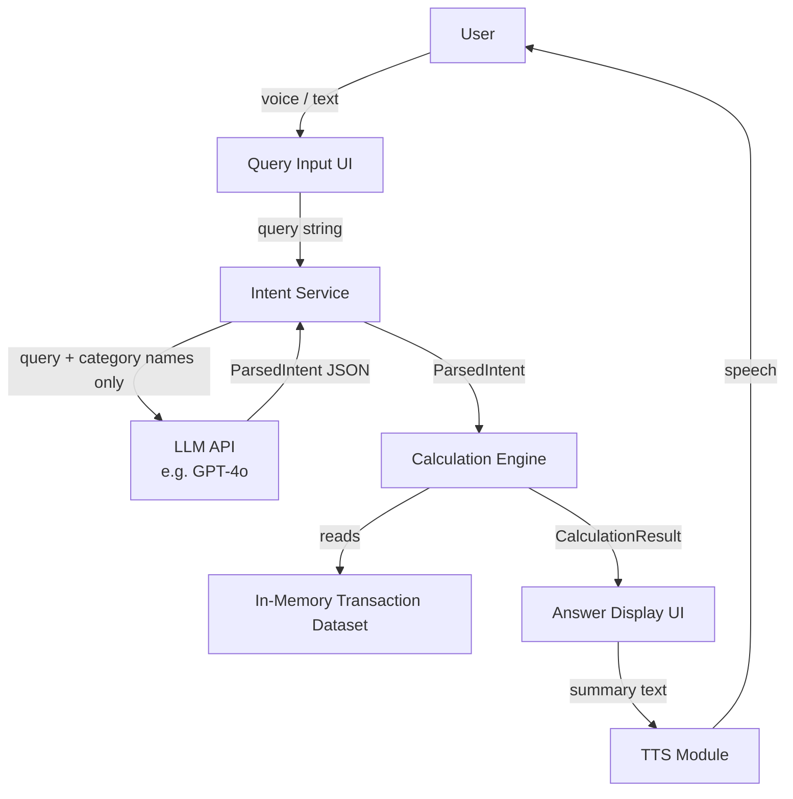
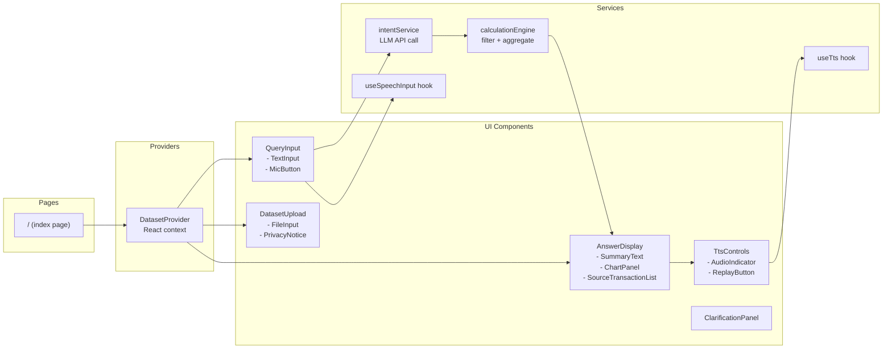

# Design Document: Tally Spending Analyst

## Overview

Tally is a natural-language spending analyst built as a demo-ready React/Next.js web application. Users ask plain-English questions — by voice or text — about their personal transaction data, and the app returns a readable answer, a supporting chart, and the source transactions that produced the result.

The core architecture separates concerns cleanly into three layers:

1. **UI Layer** — React components for input (text + voice), answer display (summary, chart, source list), and TTS playback controls.
2. **Intent Layer** — Calls the LLM API (e.g., OpenAI GPT-4o) with only the query text and available category names. Returns a structured `ParsedIntent` object (`intent_type`, `categories`, `timeframe`).
3. **Calculation Layer** — A fully deterministic, synchronous module that filters and aggregates the in-memory transaction dataset given only the structured intent. No LLM involvement here.

Key design constraints:
- **No persistence.** All data lives in React state / session memory. Nothing touches `localStorage`, `sessionStorage`, or any server-side store.
- **Privacy-first.** Transaction amounts, descriptions, and dates never leave the browser. Only category names (not values) are sent to the LLM API.
- **LLM for intent only.** The LLM is a query parser, not a calculator. All arithmetic is deterministic.
- **Graceful degradation.** Voice input (STT) and TTS each degrade silently if the browser does not support the Web Speech API, without breaking text input or answer display.

---

## Architecture

### High-Level Data Flow



### Component Architecture



### State Management Strategy

State is managed entirely in React via `useState` / `useReducer` at the page level, with a `DatasetProvider` context for the active transaction dataset. No Redux, no external state library. This keeps the app simple and avoids accidental persistence.

| State slice | Owner | Notes |
|---|---|---|
| `transactions: Transaction[]` | `DatasetProvider` | Loaded from sample or CSV; replaced on upload |
| `categories: string[]` | `DatasetProvider` | Derived from transactions; memoized |
| `queryState` | Page reducer | Idle / submitting / clarifying / answered / error |
| `currentQuery: string` | Page state | Text field value |
| `parsedIntent: ParsedIntent \| null` | Page state | Last successful LLM parse |
| `calculationResult: CalculationResult \| null` | Page state | Last CE output |
| `clarificationRound: 0 \| 1 \| 2` | Page state | Tracks clarification depth |
| `ttsState` | `useTts` hook | idle / playing / played / error |

---

## Components and Interfaces

### 1. `DatasetProvider` / `useDataset`

Holds the active `Transaction[]` and exposes `loadSampleDataset()` and `uploadCsv(file: File)`.

```ts
interface DatasetContextValue {
  transactions: Transaction[];
  categories: string[];           // distinct, sorted category names
  loadSampleDataset: () => void;
  uploadCsv: (file: File) => Promise<CsvUploadResult>;
}

type CsvUploadResult =
  | { ok: true; rowsLoaded: number; rowsSkipped: number }
  | { ok: false; error: CsvError };

type CsvError =
  | { type: 'missing_columns'; missingColumns: string[] }
  | { type: 'no_valid_rows' }
  | { type: 'file_too_large' };
```

### 2. `intentService`

Thin async function wrapping the LLM API call. Responsible for:
- Building the prompt (query text + category list only — no amounts/dates/descriptions).
- Parsing and validating the JSON response.
- Resolving relative timeframes against `Date.now()` in the user's local timezone.

```ts
async function interpretQuery(
  queryText: string,
  availableCategories: string[]
): Promise<IntentResult>

type IntentResult =
  | { ok: true; intent: ParsedIntent }
  | { ok: false; error: IntentError }

type IntentError =
  | { type: 'api_timeout' }
  | { type: 'api_failure'; statusCode?: number }
  | { type: 'missing_fields'; missingFields: string[] }
  | { type: 'unsupported_intent_type'; received: string }
  | { type: 'unresolvable_fields'; fields: string[] }
```

### 3. `calculationEngine`

Pure, synchronous function. No side effects. No API calls.

```ts
function calculate(
  intent: ParsedIntent,
  transactions: Transaction[]
): CalculationResult

interface CalculationResult {
  intentType: IntentType;
  categories: string[];
  timeframe: DateRange;
  value: number | CompareValues;   // number for sum/average/count; CompareValues for compare
  sourceTransactions: Transaction[]; // sorted: most-recent-first, then alpha by description
  zeroMatch: boolean;               // true when no rows matched the filters
}

interface CompareValues {
  categoryA: string;
  categoryB: string;
  sumA: number;
  sumB: number;
  difference: number;   // sumA - sumB
}
```

### 4. `QueryInput` / `useSpeechInput`

`QueryInput` renders the text field and mic button. `useSpeechInput` is a React hook wrapping `window.SpeechRecognition` / `window.webkitSpeechRecognition`.

```ts
interface UseSpeechInputReturn {
  supported: boolean;
  state: 'idle' | 'requesting_permission' | 'recording' | 'finalizing' | 'error';
  transcript: string;
  start: () => void;
  stop: () => void;
  error: SpeechInputError | null;
}

type SpeechInputError =
  | 'permission_denied'
  | 'not_supported'
  | 'no_speech'
  | 'init_failed';
```

Silence detection: the hook starts a 1500 ms timer on each `onresult` event; if no new result arrives before the timer fires, it calls `recognition.stop()`.

No-speech timeout: a separate 10 s timer fires `stop()` and emits `'no_speech'` if `onresult` never fires.

### 5. `useTts`

React hook wrapping `window.SpeechSynthesis`.

```ts
interface UseTtsReturn {
  supported: boolean;
  state: 'idle' | 'playing' | 'played' | 'error';
  speak: (text: string) => void;
  replay: () => void;
  stop: () => void;
}
```

Auto-play is triggered by the page when a new `CalculationResult` arrives and the triggering query was a voice query (tracked with a `querySource: 'text' | 'voice'` flag).

### 6. UI Display Components

| Component | Key Props | Responsibility |
|---|---|---|
| `SummaryText` | `result: CalculationResult` | Renders the plain-English answer sentence |
| `ChartPanel` | `result: CalculationResult` | Renders bar chart (compare) or donut chart (sum/average/count) using Recharts |
| `SourceTransactionList` | `transactions: Transaction[]` | Renders up to 100 rows; date + description + category + amount |
| `ClarificationPanel` | `fields: string[]; categories: string[]; onRespond: (text: string) => void` | Prompt with available categories |
| `DatasetUpload` | `onUpload: (r: CsvUploadResult) => void` | File picker + privacy notice |
| `InterpretedQueryBadge` | `intent: ParsedIntent` | Shows what Tally will calculate |

---

## Data Models

### `Transaction`

```ts
interface Transaction {
  date: string;       // normalized to YYYY-MM-DD after parsing
  amount: number;     // parsed float; negative = refund
  description: string;
  category: string;   // original casing from data source, trimmed
}
```

### `ParsedIntent`

```ts
type IntentType = 'sum' | 'compare' | 'average' | 'count';

interface ParsedIntent {
  intent_type: IntentType;
  categories: string[];   // 1–10 items; each ≤ 100 chars
  timeframe: DateRange;
}

interface DateRange {
  start: string;  // YYYY-MM-DD
  end: string;    // YYYY-MM-DD
}
```

### `CalculationResult`

Defined under Components and Interfaces §3 above.

### CSV Parsing

The CSV parser runs entirely in the browser (using a library such as `PapaParse`). Parsing steps:

1. Validate file size ≤ 10 MB.
2. Parse headers; check for required columns (`date`, `amount`, `description`, `category`). If any are missing, return `CsvError { type: 'missing_columns' }`.
3. For each row:
   - Attempt date parse: `YYYY-MM-DD` then `MM/DD/YYYY`. If neither succeeds, skip the row and increment `rowsSkipped`.
   - Attempt `parseFloat(amount)`. If `NaN`, skip the row.
   - Trim whitespace from `description` and `category`.
4. If `rowsSkipped === totalRows`, return `CsvError { type: 'no_valid_rows' }`.
5. Otherwise return `{ ok: true, rowsLoaded, rowsSkipped }` and update `DatasetProvider`.

### Sample Dataset

The built-in sample dataset is a static JSON/TS file bundled with the app. It contains:
- ≥ 90 days of transactions
- ≥ 6 categories: Groceries, Dining Out, Transport, Entertainment, Utilities, Shopping
- 200–400 rows (enough for meaningful aggregation and chart rendering without being unwieldy)

### LLM Prompt Design

The prompt sent to the LLM API contains:
- A system message describing the four `intent_type` values and expected JSON schema
- The user's query text
- The list of available category names (only names, no values)

Example system message excerpt:
```
You are a query parser for a personal finance app. 
Return ONLY valid JSON with these fields:
- intent_type: one of "sum" | "compare" | "average" | "count"
- categories: array of 1-10 strings matching provided category names
- timeframe: { start: "YYYY-MM-DD", end: "YYYY-MM-DD" } resolved to today's date
If you cannot resolve a field, set it to null.
Available categories: {categoriesList}
```

---

## Correctness Properties

*A property is a characteristic or behavior that should hold true across all valid executions of a system — essentially, a formal statement about what the system should do. Properties serve as the bridge between human-readable specifications and machine-verifiable correctness guarantees.*

### Property 1: CSV parse round-trip preserves valid rows

*For any* CSV file containing N valid rows (parseable date, numeric amount, non-empty description, non-empty category), parsing the file and loading it into the transaction dataset SHALL yield exactly N transactions, each with the same date, amount, description, and category as the source row.

**Validates: Requirements 1.3, 1.6**

---

### Property 2: Invalid-amount rows are always skipped

*For any* CSV file where a subset of rows have an `amount` field that cannot be parsed as a number (e.g., empty string, alphabetic text, symbols), those rows SHALL be excluded from the loaded transaction dataset and the loaded count SHALL equal the number of valid-amount rows.

**Validates: Requirements 1.6**

---

### Property 3: Missing required columns reject the file

*For any* CSV file that is missing at least one of the required columns (`date`, `amount`, `description`, `category`), the upload SHALL fail with a `missing_columns` error identifying all absent columns, and the previously active transaction dataset SHALL remain unchanged.

**Validates: Requirements 1.5**

---

### Property 4: Whitespace-only queries are rejected

*For any* string composed entirely of whitespace characters (spaces, tabs, newlines), submitting it as a query SHALL be rejected before any API call is made, and the query state SHALL remain idle.

**Validates: Requirements 2.5**

---

### Property 5: Calculation Engine sum correctness

*For any* transaction dataset and any `sum` intent with a given category set and date range, the Calculation Engine's returned value SHALL equal the arithmetic sum of the `amount` fields of all transactions whose `category` matches any element of the intent's `categories` (case-insensitive) and whose `date` is within the intent's `timeframe` (inclusive).

**Validates: Requirements 5.1, 5.2**

---

### Property 6: Calculation Engine average correctness

*For any* transaction dataset and any `average` intent, the Calculation Engine's returned value SHALL equal the sum of the matching transaction amounts divided by the count of matching transactions, rounded to two decimal places using half-up rounding.

**Validates: Requirements 5.1, 5.4, 5.6**

---

### Property 7: Calculation Engine compare correctness

*For any* transaction dataset and any `compare` intent with two categories A and B, the Calculation Engine SHALL return `sumA`, `sumB`, and `difference` such that `difference === sumA - sumB`, and each sum SHALL equal the arithmetic sum of matching transactions for that category within the timeframe.

**Validates: Requirements 5.1, 5.3**

---

### Property 8: Zero-match returns zero and sets zeroMatch flag

*For any* transaction dataset and any intent whose category/timeframe filter matches zero transactions, the Calculation Engine SHALL return a numeric value of `0` and set `zeroMatch: true`.

**Validates: Requirements 5.7, 5.8**

---

### Property 9: Calculation uses only LLM-provided intent fields

*For any* valid `ParsedIntent`, the Calculation Engine's output SHALL be a deterministic function of (1) the intent's `categories`, `timeframe`, and `intent_type` and (2) the transaction dataset — it SHALL NOT vary based on the original query text, the current time, or any external call.

**Validates: Requirements 4.4, 5.9**

---

### Property 10: Source transaction list is correctly sorted

*For any* non-empty list of source transactions, the list SHALL be ordered with the most recent `date` first; transactions sharing the same `date` SHALL be ordered alphabetically ascending by `description`.

**Validates: Requirements 6.5**

---

### Property 11: Source transaction list is capped at 100

*For any* calculation result, the source transaction list exposed to the UI SHALL contain at most 100 transactions, even when the total matching set exceeds 100 rows.

**Validates: Requirements 6.4**

---

### Property 12: Privacy — no amounts/descriptions/dates in LLM payload

*For any* query and any transaction dataset, the payload sent to the LLM API SHALL contain only the query text and the list of distinct category names — it SHALL NOT contain any transaction amount, description, or date value.

**Validates: Requirements 4.2, 9.1**

---

### Property 13: No data persistence across queries

*For any* sequence of queries within a session, the application state at the start of processing a new query SHALL contain no answer data, chart data, or source transactions from the previous query (they are cleared on submission of the new query).

**Validates: Requirements 6.7, 9.2, 9.4**

---

### Property 14: Category match is case-insensitive

*For any* transaction dataset and any intent, a transaction whose `category` field differs from an intent `categories` entry only in letter casing SHALL be included in the filtered set, not excluded.

**Validates: Requirements 5.1**

---

### Property 15: Clarification round counter never exceeds 2

*For any* sequence of query submissions and clarification responses, the clarification round counter SHALL never exceed 2; if a second clarification also fails, the system SHALL display a terminal error message and reset to idle rather than issuing a third clarification prompt.

**Validates: Requirements 8.4**

---

## Error Handling

### Error Categories and Responses

| Error | User-visible message | System action |
|---|---|---|
| LLM API timeout (>5 s) | "Couldn't reach the analysis service. Please try again." | Log event (no query text), reset to idle |
| LLM API non-2xx | "The analysis service returned an error. Please try again." | Log status code, reset to idle |
| LLM missing/invalid fields | "I couldn't understand that question. Could you rephrase it?" | Trigger clarification round 1 |
| Unsupported `intent_type` | "That question type isn't supported yet. Try asking for a total, average, or comparison." | Reset to idle |
| CSV missing columns | "Your file is missing these required columns: [list]. Please fix the file and try again." | Retain active dataset |
| CSV no valid rows | "No valid transactions were found in this file. Please check the format and try again." | Retain active dataset |
| CSV row skips | "Loaded N rows. M rows were skipped due to unrecognised date or amount formats." | Load valid rows; show warning banner |
| CSV file too large | "This file exceeds the 10 MB limit. Please upload a smaller file." | Reject; retain active dataset |
| No matching transactions | "No transactions found for [category] in [timeframe]." | Display in place of chart + source list |
| STT permission denied | "Microphone access was denied. You can still type your question." | Hide mic button |
| STT not supported | "Voice input isn't available in this browser. You can still type your question." | Hide mic button |
| STT no speech (10 s) | "We didn't detect any speech. Please try again." | Stop recording; focus text field |
| TTS failure mid-speech | "Audio playback failed." | Stop; re-enable replay button |
| TTS not supported | *(silent)* | Hide audio indicator and replay button |
| Performance >10 k rows | "Large dataset detected — calculations may take a moment." | Show warning; proceed |

### Error Isolation Principles

- **STT failures never block text input.** The mic button is hidden or shows an error independently; the text field remains functional.
- **TTS failures never block answer display.** The written answer remains fully visible even if audio fails.
- **LLM failures never trigger a calculation attempt.** The Calculation Engine is only called with a validated `ParsedIntent`.
- **CSV errors never corrupt the active dataset.** Errors are returned as values; the dataset is only replaced on a fully successful parse.

---

## Testing Strategy

### Approach

Tally's logic separates cleanly into pure, deterministic functions (CSV parser, Calculation Engine, intent validator) and side-effectful browser APIs (LLM calls, Web Speech API, `SpeechSynthesis`). The testing strategy reflects this split.

### Unit / Example-Based Tests

Cover specific behaviors and error paths that are not universal across all inputs:

- **CSV parser**: valid file loads; missing-column rejection; all-rows-invalid rejection; partial-skip with warning message; file-too-large rejection; date format acceptance (both `YYYY-MM-DD` and `MM/DD/YYYY`).
- **Intent validator**: correctly rejects responses missing `intent_type`, `categories`, or `timeframe`; correctly handles `null` fields; rejects unknown `intent_type` strings.
- **Answer display**: `SummaryText` renders correct sentence for each `intent_type`; `ChartPanel` renders bar chart for `compare` and donut for others; `SourceTransactionList` renders at most 100 rows.
- **Clarification flow**: round 1 shows prompt; round 2 shows second prompt; round 2 failure shows terminal message.
- **TTS/STT**: hooks correctly reflect `supported: false` when browser API is absent; `useSpeechInput` emits `no_speech` after 10 s silence.

### Property-Based Tests

Tally's Calculation Engine and CSV parser are pure functions with large input spaces — ideal candidates for property-based testing. Use **fast-check** (TypeScript/JavaScript PBT library).

Configure each test suite with a minimum of **100 runs**.

Tag format: `// Feature: tally-spending-analyst, Property N: <property_text>`

**In scope for PBT:**
- Calculation Engine (Properties 5–10, 14)
- CSV parser (Properties 1–3)
- Query validation (Property 4)
- Privacy invariant (Property 12) — via mock of the LLM call spy, asserting the captured payload
- Clarification counter (Property 15) — via state machine enumeration
- Sorting (Property 10)

**Not in scope for PBT:**
- LLM API responses (external service — use integration tests with mock/recorded responses)
- TTS/STT behavior (browser API — use example-based tests with mocked `SpeechSynthesis` / `SpeechRecognition`)
- Chart rendering (UI — use snapshot tests)
- WCAG compliance (requires manual testing with assistive technologies)

### Integration Tests

- End-to-end query flow with a mocked LLM response: submit text query → receive `ParsedIntent` → run Calculation Engine → display answer.
- CSV upload → dataset replace → query → verify answer reflects new data.
- Voice query flow: mocked `SpeechRecognition` fires transcript → text field pre-populated → user submits → answer displayed → TTS auto-plays.

### Snapshot Tests

- `ChartPanel` renders consistent bar/donut chart markup for a fixed `CalculationResult` input.
- `AnswerDisplay` renders consistent layout for each answer state (loading, answered, zero-match, error).

### Accessibility Testing

- Automated: `jest-axe` or `axe-core` on all major page states to catch common WCAG 2.1 AA violations.
- Manual: keyboard-only navigation walkthrough; screen reader announcement of STT state transitions via ARIA live regions.
- Note: full WCAG 2.1 AA compliance requires manual testing with assistive technologies and expert accessibility review beyond automated checks.
